# Pycoder 统一数据库架构设计文档

> 版本: v2.0 | 日期: 2026-07-13 | 状态: 已实施

---

## 一、架构概览

### 1.1 设计目标

将 pycoder 项目中分散的 **6 个独立 SQLite 数据库** 统一为单文件架构:

| 旧数据库文件 | 表数量 | 所服务模块 |
|---|---|---|
| `sessions.db` / `pycoder.db` | 2 | session_store + chat_handler |
| `memory.db` + `long_term_memory.db` | 2 | agent_memory + memory_augmentor |
| `knowledge.db` | 3 | knowledge_base (自进化) |
| `metrics.db` | 3 | metrics_tracker (进化指标) |
| `cloud.db` | 3 | cloud_service (用户体系) |
| `teams.db` | 4 | team_workspace (团队协作) |

**统一后**: 所有表合并到 `~/.pycoder/unified.db` (17+ 张表)

### 1.2 核心原则

1. **单文件多表** — 一个 `unified.db` 承载所有模块数据
2. **命名空间隔离** — 表名按前缀分组 (`sessions_*`, `memory_*`, `evolution_*`, `cloud_*`, `team_*`)
3. **双引擎兼容** — sqlite3 原生 API + SQLAlchemy ORM 共存
4. **向后兼容** — 自动检测并迁移旧多库数据
5. **WAL + FK** — 生产级并发 + 数据完整性
6. **可扩展** — `app_config` + `plugin_data` 两张通用表

---

## 二、ER 图 (Entity-Relationship)

```mermaid
erDiagram
    sessions ||--o{ messages : "1:N (CASCADE)"
    sessions ||--o{ memory_items : "1:N (session_id)"
    memory_items }o--|| sessions : "optional FK"
    cloud_users ||--o{ cloud_usage_log : "1:N"

    sessions {
        TEXT id PK "UUID"
        REAL created_at "创建时间"
        REAL updated_at "更新时间"
        TEXT model "deepseek-chat|gpt-4|..."
        TEXT project_path "项目路径"
        TEXT title "会话标题"
        INTEGER message_count "消息计数"
        TEXT metadata "JSON扩展"
        TEXT task_goal "P6:任务目标"
        TEXT task_phase "P6:任务阶段"
        INTEGER task_progress "P6:进度%"
    }

    messages {
        INTEGER id PK "自增"
        TEXT session_id FK "→sessions.id"
        TEXT role "user|assistant|system|tool"
        TEXT content "消息内容"
        REAL timestamp "时间戳"
        TEXT metadata "JSON扩展"
        REAL importance "P6:重要性评分"
        INTEGER is_decision "P6:是否关键决策"
        INTEGER is_milestone "P6:是否里程碑"
    }

    memory_items {
        INTEGER id PK "自增"
        TEXT session_id "可选关联"
        TEXT project "所属项目"
        TEXT key "记忆键"
        TEXT content "记忆内容"
        TEXT fact_type "decision|error|file_ref"
        TEXT tags "JSON数组"
        REAL importance "0-1重要性"
        INTEGER access_count "引用次数"
        REAL created_at "创建时间"
        REAL last_accessed "最后访问"
        INTEGER ttl_days "过期天数"
    }

    evolution_records {
        INTEGER id PK "自增"
        TEXT task_id "任务ID"
        TEXT operation "操作类型"
        TEXT outcome "结果"
        INTEGER lines_changed "变更行数"
        INTEGER bugs_fixed "修复bug数"
        REAL quality_score "质量分"
        INTEGER tokens_used "Token消耗"
        REAL cost_usd "成本美元"
        TEXT tags "JSON标签"
        REAL timestamp "时间戳"
    }

    cloud_users {
        TEXT id PK "UUID"
        TEXT username UK "用户名"
        TEXT email "邮箱"
        TEXT password_hash "bcrypt哈希"
        TEXT plan "free|pro|team"
        INTEGER tokens_used_today "今日Token"
        INTEGER is_active "是否活跃"
        REAL created_at "注册时间"
    }

    team_workspaces {
        TEXT id PK "UUID"
        TEXT name "空间名"
        TEXT created_by "创建者ID"
        REAL created_at "创建时间"
        TEXT settings_json "JSON配置"
    }

    team_workspaces ||--o{ team_members : "1:N"
    team_workspaces ||--o{ team_review_requests : "1:N"
    team_workspaces ||--o{ team_activities : "1:N"

    team_members {
        TEXT id PK
        TEXT workspace_id FK "→workspaces"
        TEXT display_name "显示名"
        TEXT role "owner|admin|member"
        REAL joined_at "加入时间"
        REAL last_active_at "活跃时间"
    }

    team_review_requests {
        TEXT id PK
        TEXT workspace_id FK
        TEXT title "审查标题"
        TEXT file_path "文件路径"
        TEXT code_snippet "代码片段"
        TEXT status "open|resolved|closed"
        REAL created_at "创建时间"
        REAL resolved_at "解决时间"
    }

    team_activities {
        TEXT id PK
        TEXT workspace_id FK
        TEXT user_id "用户ID"
        TEXT action "动作描述"
        REAL timestamp "时间戳"
    }

    app_config {
        TEXT key PK "配置键"
        TEXT value "配置值"
        TEXT kind "string|json|int|float|bool"
        TEXT description "描述"
        REAL updated_at "更新时间"
    }

    plugin_data {
        INTEGER id PK "自增"
        TEXT plugin_id "插件ID"
        TEXT key "数据键"
        TEXT value "数据值"
        TEXT kind "json|blob|text"
        REAL created_at "创建时间"
        REAL updated_at "更新时间"
    }
```



---

## 三、表结构详细说明

### 3.1 会话消息 (sessions + messages)

| 列 | 类型 | 约束 | 说明 |
|---|---|---|---|
| `sessions.id` | TEXT | PK | UUID v4 |
| `sessions.model` | TEXT | DEFAULT 'auto' | 使用的 LLM 模型 |
| `sessions.task_goal` | TEXT | | P6: 任务总目标 |
| `sessions.task_phase` | TEXT | | P6: init/analyzing/executing/done |
| `messages.importance` | REAL | DEFAULT 0.5 | P6: 消息重要性评分 |
| `messages.is_decision` | INTEGER | DEFAULT 0 | P6: 0/1 标记关键决策 |

### 3.2 长期记忆 (memory_items)

合并 `session_memories` + `long_term_memory` 为统一表。

```sql
-- 核心查询: 检索相关记忆
SELECT * FROM memory_items
WHERE (key LIKE '%认证%' OR content LIKE '%认证%' OR tags LIKE '%认证%')
  AND importance >= 0.1
ORDER BY importance DESC, access_count DESC
LIMIT 5;
```

### 3.3 进化系统 (evolution_*)

4 张表支持自进化引擎的完整数据闭环:

- `evolution_records` — 每次进化操作的完整记录
- `evolution_error_patterns` — 错误模式与修复模板
- `evolution_fix_history` — 修复历史追踪
- `evolution_quality_snapshots` — 质量快照(定期采集)
- `evolution_learning_events` — 学习事件日志

### 3.4 通用扩展 (app_config + plugin_data)

**app_config** — 键值对存储，替代硬编码配置文件:

```sql
-- 存储配置
INSERT INTO app_config (key, value, kind, description)
VALUES ('cache.ttl', '3600', 'int', '缓存过期时间(秒)');

-- 读取配置
SELECT value FROM app_config WHERE key = 'cache.ttl';
```

**plugin_data** — 为任意插件提供隔离的持久化存储:

```sql
-- 插件写入
INSERT INTO plugin_data (plugin_id, key, value)
VALUES ('docker-manager', 'containers', '[...]')
ON CONFLICT(plugin_id, key) DO UPDATE SET value=excluded.value;

-- 插件读取
SELECT value FROM plugin_data WHERE plugin_id = 'docker-manager' AND key = 'containers';
```

---

## 四、数据访问层 (DAL) 接口规范

### 4.1 单例获取

```python
from pycoder.core.dal import get_dal

dal = get_dal()  # 自动初始化 + Schema 升级
```

### 4.2 查询 API

| 方法 | 签名 | 说明 |
|---|---|---|
| `execute` | `(sql, params?) -> list[Row]` | 参数化查询，返回行列表 |
| `execute_one` | `(sql, params?) -> Row?` | 返回第一行或 None |
| `execute_value` | `(sql, params?, default?) -> Any` | 返回单值 |
| `execute_many` | `(sql, params_list) -> int` | 批量执行 (executemany) |

### 4.3 写入 API

| 方法 | 说明 |
|---|---|
| `insert(table, data)` | 插入一行，返回 rowid |
| `insert_or_replace(table, data)` | 冲突时 REPLACE |
| `insert_or_ignore(table, data)` | 冲突时跳过 |
| `update(table, data, where, params)` | 条件更新，返回影响行数 |
| `delete(table, where, params)` | 条件删除，返回影响行数 |
| `upsert(table, data, conflict_cols, update_cols?)` | INSERT OR UPDATE |
| `batch_insert(table, rows)` | 批量插入(单事务) |

### 4.4 事务

```python
with dal.transaction():
    dal.insert("sessions", {...})
    dal.insert("messages", {...})
    # 任何异常自动回滚
```

### 4.5 使用规范

```python
# ✅ 正确: 使用 DAL
dal = get_dal()
rows = dal.execute("SELECT * FROM sessions WHERE id = ?", (sid,))

# ✅ 正确: 事务
with dal.transaction():
    dal.insert("messages", {...})

# ❌ 禁止: 直接连接
conn = sqlite3.connect("unified.db")  # 绕过连接池和 Schema 管理

# ✅ 正确: 参数化查询（防注入）
dal.execute("SELECT * FROM users WHERE name = ?", (name,))

# ❌ 禁止: 字符串拼接
dal.execute(f"SELECT * FROM users WHERE name = '{name}'")
```

---

## 五、数据迁移方案

### 5.1 自动迁移

DAL 首次初始化时自动执行:

1. 检测 `db_version` 表，无记录则执行完整 SCHEMA
2. 写入当前 `DB_VERSION = 2`
3. `_migrate_v1_to_v2()` 扫描 `~/.pycoder/` 下的旧 `.db` 文件
4. 查找对应表，数据批量复制到新表
5. 使用 `INSERT OR IGNORE` 避免重复

### 5.2 迁移映射

| 旧路径 | 旧表 | 新表 |
|---|---|---|
| `sessions.db` | `sessions` | `sessions` |
| `sessions.db` | `messages` | `messages` |
| `memory.db` | `session_memories` | `memory_items` |
| `long_term_memory.db` | `long_term_memory` | `memory_items` |
| `knowledge.db` | `error_patterns` | `evolution_error_patterns` |
| `knowledge.db` | `fix_history` | `evolution_fix_history` |
| `metrics.db` | `evolution_records` | `evolution_records` |
| `metrics.db` | `quality_snapshots` | `evolution_quality_snapshots` |
| `metrics.db` | `learning_events` | `evolution_learning_events` |
| `cloud.db` | `users` | `cloud_users` |
| `cloud.db` | `api_keys` | `cloud_api_keys` |
| `cloud.db` | `usage_log` | `cloud_usage_log` |
| `teams.db` | `workspaces` | `team_workspaces` |
| `teams.db` | `members` | `team_members` |
| `teams.db` | `review_requests` | `team_review_requests` |
| `teams.db` | `activities` | `team_activities` |

### 5.3 回滚保障

- 迁移不删除原始数据库文件
- 手动回滚: `rm ~/.pycoder/unified.db` + 重启服务
- 数据验证: `dal.get_db_info()` 查看各表行数

---

## 六、扩展方案

### 6.1 新增模块接入步骤

```python
# 1. 在 SCHEMA_SQL 中添加 CREATE TABLE
# 2. 在 Tables 类中添加常量
# 3. 使用 DAL 访问
from pycoder.core.dal import get_dal

dal = get_dal()
dal.insert("my_new_table", {...})
rows = dal.execute("SELECT * FROM my_new_table WHERE ...")
```

### 6.2 通用扩展表使用

新功能可优先使用 `app_config` 和 `plugin_data`:

```python
# 简单配置: app_config
dal.insert_or_replace("app_config", {
    "key": "my_feature.enabled",
    "value": "true",
    "kind": "bool",
})

# 复杂数据: plugin_data
dal.upsert("plugin_data",
    {"plugin_id": "my-feature", "key": "state", "value": json_data},
    conflict_columns=["plugin_id", "key"],
)
```

### 6.3 版本升级流程

1. 在 `db_schema.py` 中 `DB_VERSION += 1`
2. 在 `SCHEMA_SQL` 中添加新表 DDL
3. 在 `DAL._check_and_upgrade()` 中添加 `if current < N` 升级逻辑
4. 测试 `dal.init_db()` 在旧数据库上的升级路径

---

## 七、安全与验证

### 7.1 SQL 注入防护

- ✅ 所有查询必须使用 `?` 占位符 + 参数元组
- ✅ 严禁 f-string 或 % 格式化拼接 SQL
- ✅ 表名/列名如需动态，使用白名单校验

### 7.2 数据完整性

- `PRAGMA foreign_keys=ON` 强制外键
- 会话删除时自动级联删除消息 (`ON DELETE CASCADE`)
- WAL 模式提供崩溃恢复

### 7.3 并发控制

- 读取: 线程本地连接缓存 + 连接池 (5 conns)
- 写入: `_write_lock` 写串行化 (SQLite 单写限制)
- 超时: `PRAGMA busy_timeout=5000` (5s)

---

## 八、文件清单

| 文件 | 用途 |
|---|---|
| `pycoder/core/db_schema.py` | Schema 定义 + 表名常量 + SCHEMA_SQL |
| `pycoder/core/dal.py` | 数据访问层 (连接池/查询/事务/迁移) |
| `pycoder/server/unified_db.py` | 统一路径配置 (← 更新为 unified.db) |
| `pycoder/server/session_store.py` | 会话存储 (API不变, 后续迁移到 DAL) |
| `pycoder/server/services/memory_augmentor.py` | 长期记忆 (路径更新为 unified.db) |

---
*本文档随 `db_schema.py` 同步更新。Schema 变更时需更新 DB_VERSION 及本文件。*
